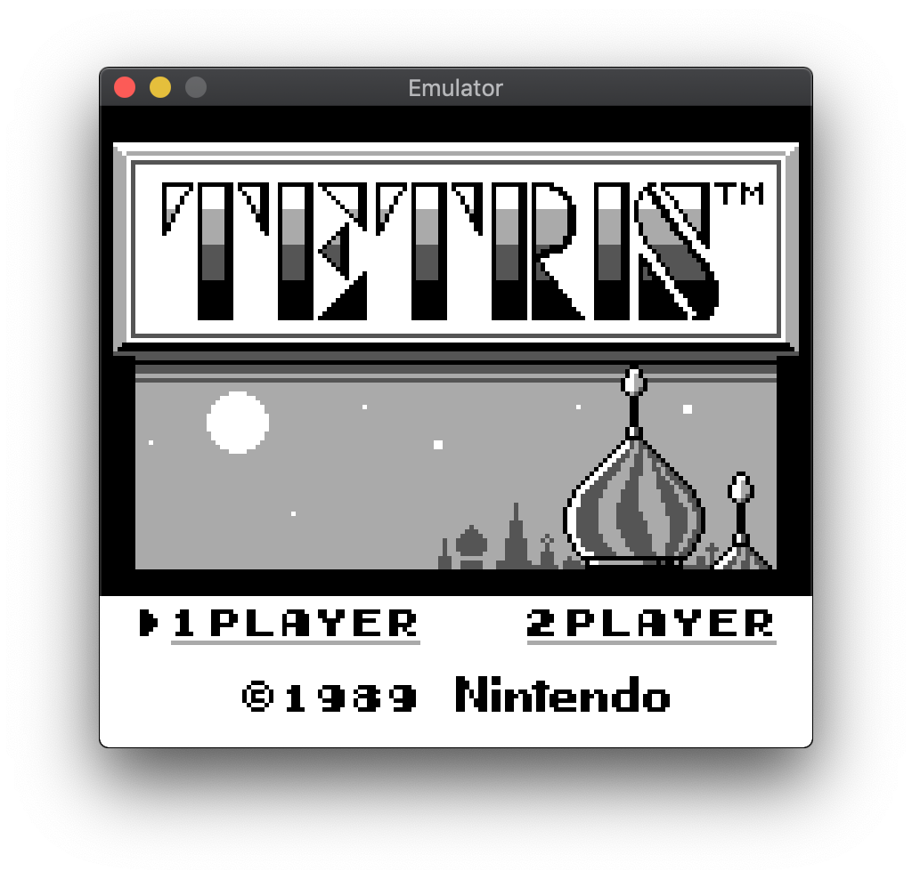
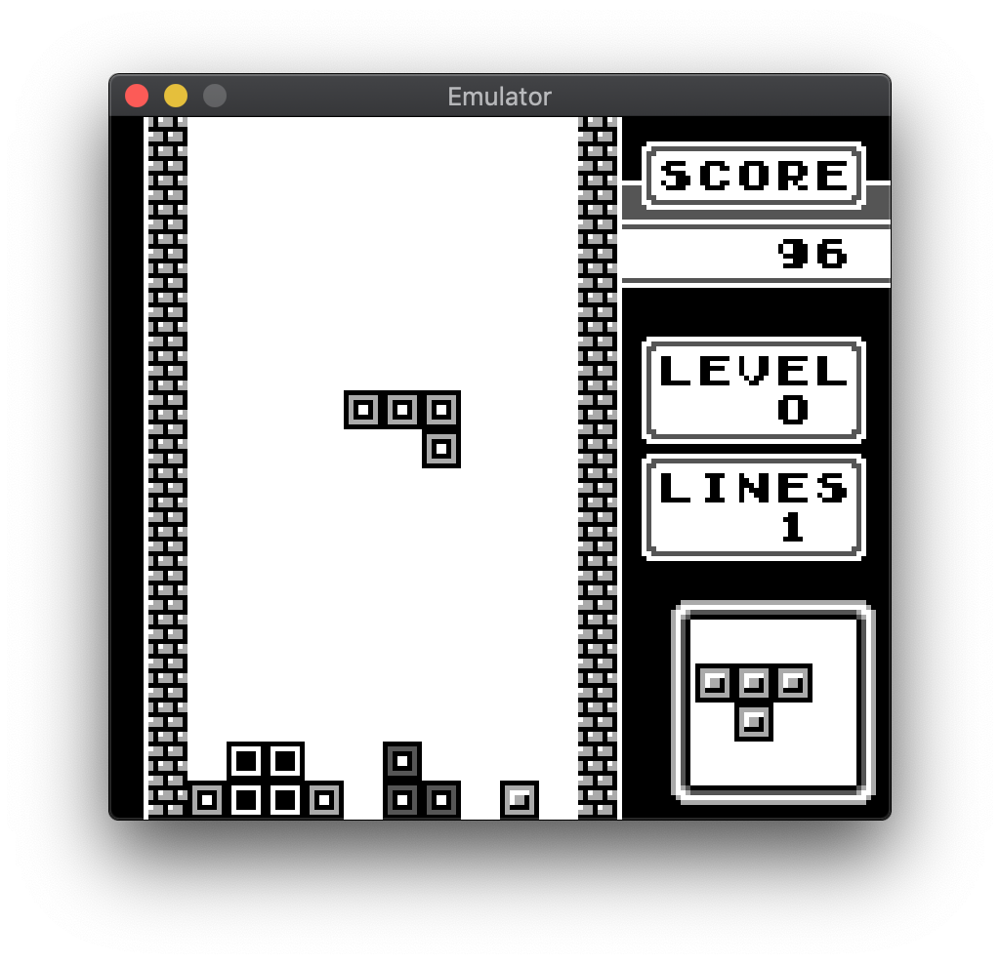
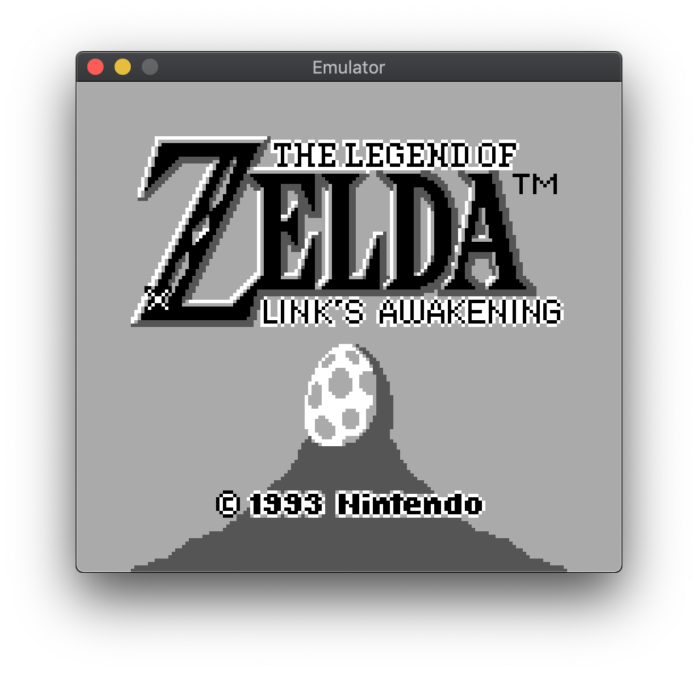
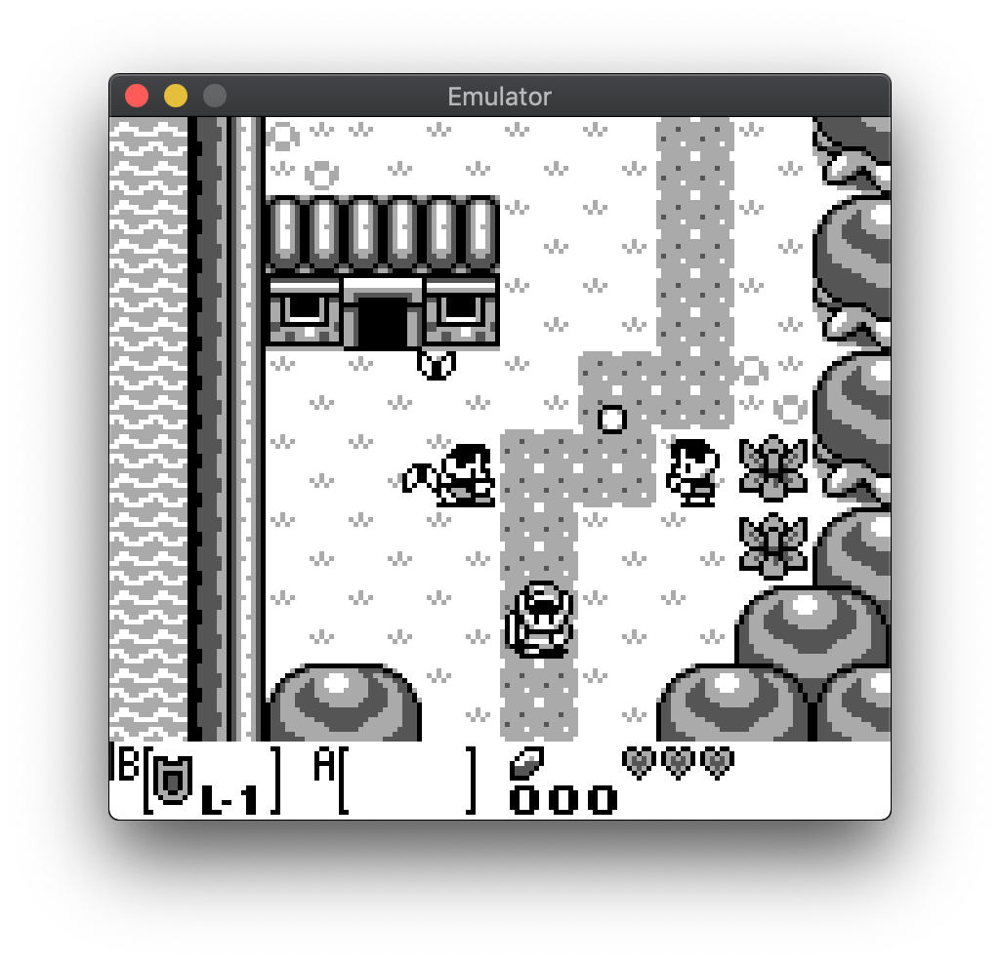
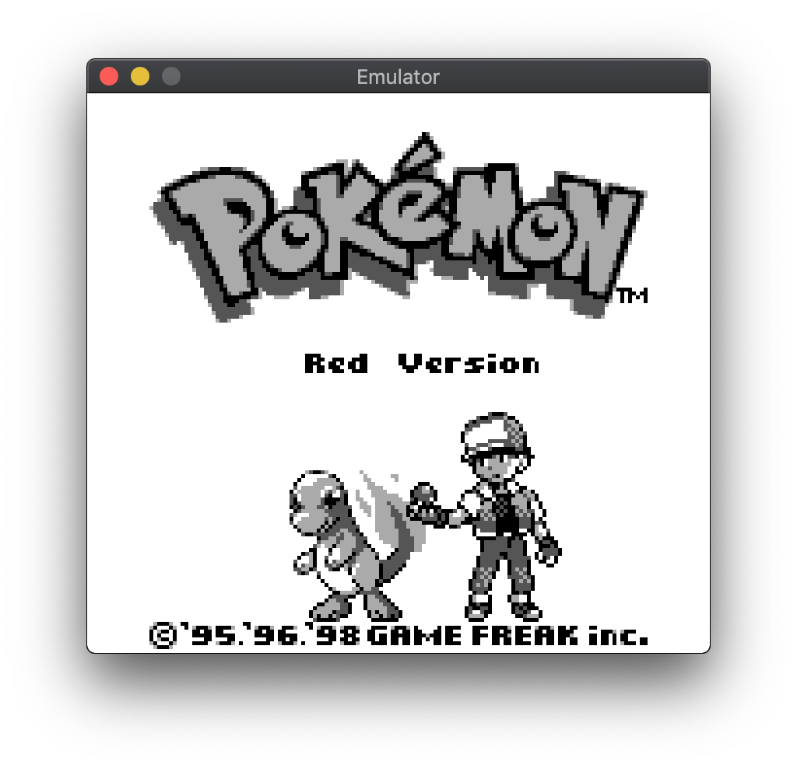
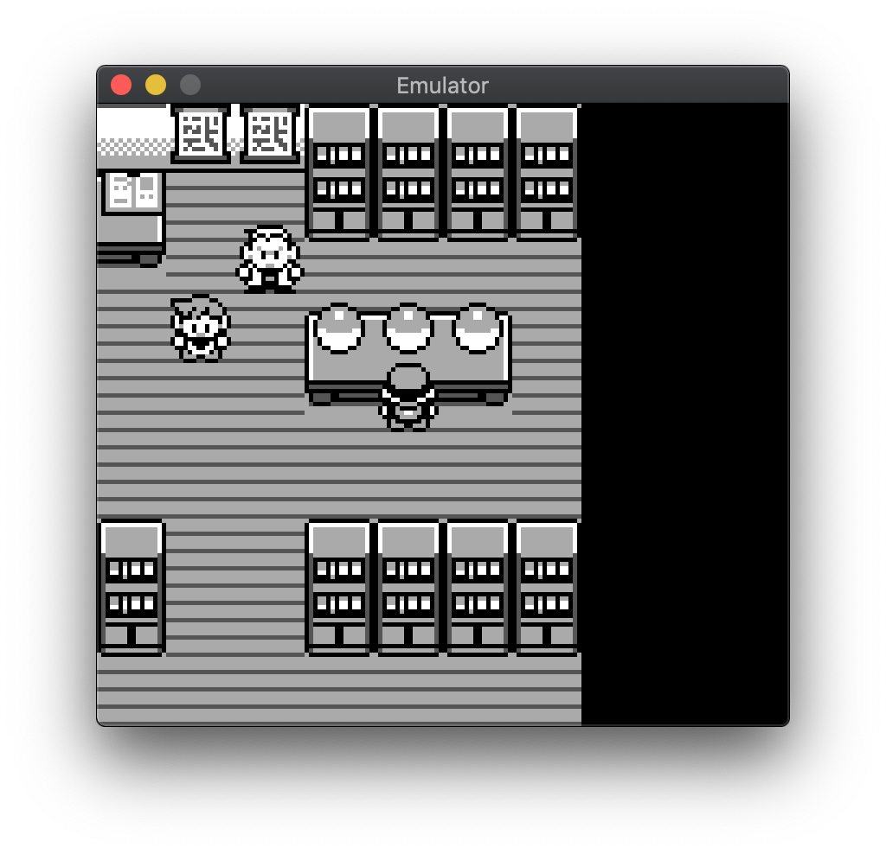

# gbemu

`gbemu` is a Nintendo Gameboy emulator written in C++. It was written as an exercise (and for fun!) so its goals are exploration of modern C++ and clean code rather than total accuracy.

## Building

Building the emulator requires `cmake` and SDL and has been tested on macOS and Debian. To compile the project, run:

```sh
$ make
```

This builds two versions of the emulator:

* `gbemu` - the main emulator, using SDL for graphics and input
* `gbemu-test` - a headless version of the emulator for debugging & running tests

## Playing

```
usage: gbemu <rom_file> [--debug] [--trace] [--silent] [--exit-on-infinite-jr] [--print-serial-output]

arguments:
  --debug                   Enable the debugger
  --exit-on-infinite-jr     Stop emulation if an infinite JR loop is detected
  --print-serial-output     Print data sent to the serial port
  --trace                   Enable trace logging
  --silent                  Disable logging
```

The key bindings are: <kbd>&uarr;</kbd>, <kbd>&darr;</kbd>, <kbd>&larr;</kbd>, <kbd>&rarr;</kbd>, <kbd>X</kbd>, <kbd>Z</kbd>, <kbd>Enter</kbd>, <kbd>Backspace</kbd>.

## Tests

The emulator is tested using [Blargg's tests][blarggs] - these can be ran with `./scripts/run_test_roms`.


## Missing features

Currently, `gbemu` only supports Gameboy games. I'm working on Gameboy Color support off-and-on at the moment. There's also no audio support yet.

## Screenshots

Menu | Gameplay
:-------------------------:|:-------------------------:
 | 
 | 
 | 

[blarggs]: http://gbdev.gg8.se/wiki/articles/Test_ROMs
